# Microsoft Entra ID Identity & Access Management Lab

## Overview

This hands-on lab was built to develop practical experience with **Microsoft Entra ID identity administration, authentication security, role-based access control, Conditional Access, sign-in investigation, and user lifecycle management**.

The environment uses a Microsoft 365 Business Premium lab tenant with fictional test identities. The project is designed around tasks commonly performed by IT Support, Service Desk, System Analyst, and Junior Microsoft 365 / Identity administrators.

> **Environment:** Personal lab / test tenant — not a production environment.

---

## Technologies & Concepts

- Microsoft Entra ID
- Microsoft 365 Business Premium
- Users and security groups
- Role-Based Access Control (RBAC)
- Least-privilege administration
- Microsoft Authenticator
- Multifactor Authentication (MFA)
- Conditional Access
- Sign-in logs
- Audit logs
- Account lifecycle / offboarding
- Intune device compliance integration

---

## Lab Objectives

- Create and manage cloud identities
- Organize users with security groups
- Assign Microsoft 365 licensing
- Separate standard-user and administrative identities
- Apply least-privilege directory roles
- Configure and validate Microsoft Authenticator
- Require MFA through Conditional Access
- Validate policies in Report-only mode before enforcement
- Investigate failed sign-ins and Entra error codes
- Disable a user and verify access is blocked
- Confirm administrative changes through audit logs
- Integrate Conditional Access with Intune device compliance

---

## 1. User Administration

I created multiple fictional test identities to simulate a small business environment and used them for different administration and troubleshooting scenarios.

The lab users included identities for IT support, finance/sales-style users, and offboarding tests.

### Evidence

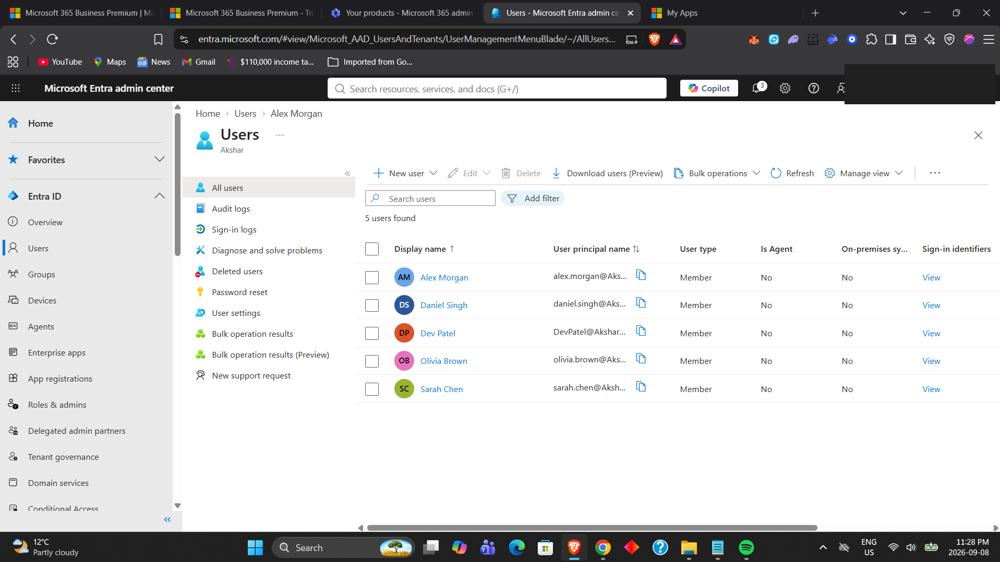

---

## 2. Security Groups & Membership

I created security groups to scope access and policies, including pilot groups used for MFA, Intune, and departmental administration.

A test user was added to the `SG-IT-Support` group to demonstrate group-based administration.

### Evidence

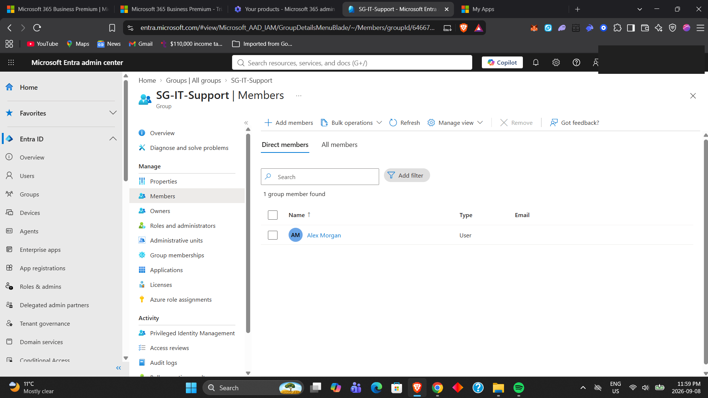

---

## 3. Microsoft 365 Licensing

I verified Microsoft 365 Business Premium licensing on the test identity and confirmed the license was active with the included service plans enabled.

This reinforced the distinction between:

**Identity** → the user exists in Entra ID  
**Entitlement** → the user has a license that enables Microsoft 365 services

### Evidence

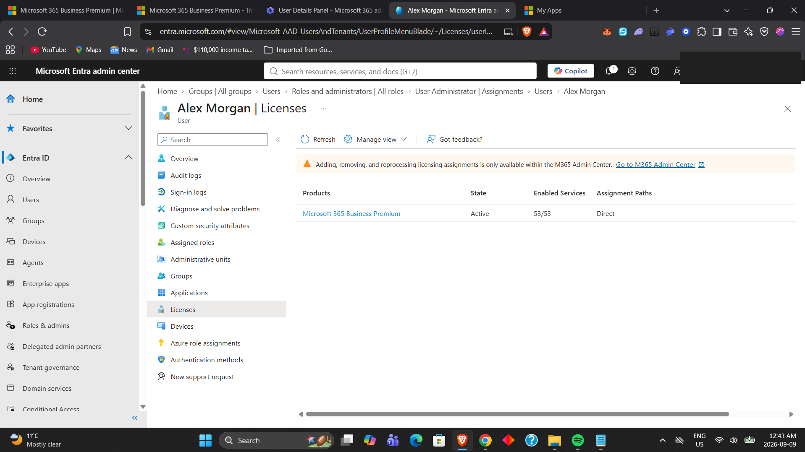

---

## 4. RBAC & Least-Privilege Administration

I created a separate administrative identity and assigned only the directory roles required for the lab instead of relying on a broad global administrator account for routine tasks.

The lab included role assignments such as:

- User Administrator
- Authentication Administrator
- Authentication Policy Administrator
- Conditional Access Administrator

This demonstrates the principle of **least privilege** and separation between normal-user and administrative identities.

### Evidence

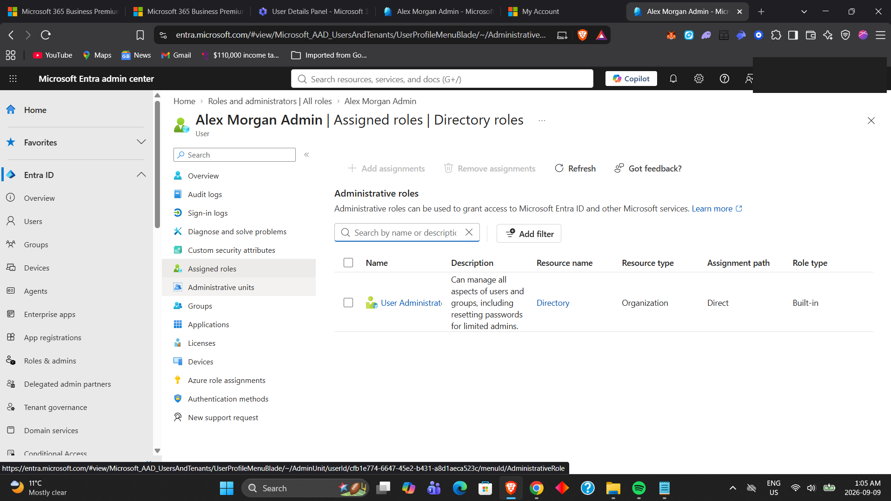

---

## 5. Microsoft Authenticator & MFA

I configured the Microsoft Authenticator authentication method policy and verified registration for the test user.

I also practised MFA re-registration as part of an authentication-support scenario.

### Evidence

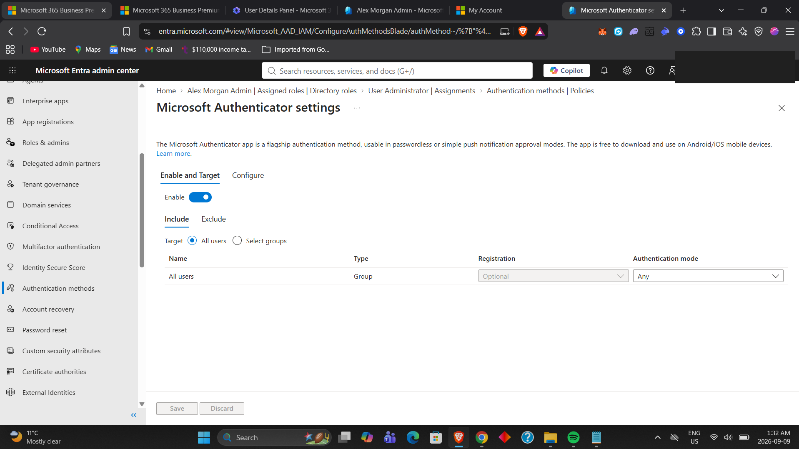

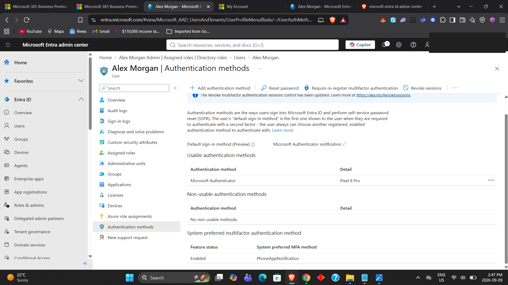

---

## 6. Conditional Access — MFA Pilot

I created a pilot Conditional Access policy named:

`CA-PILOT-Require-MFA`

The policy targeted a pilot group and required multifactor authentication for access.

I first used **Report-only mode** to evaluate policy behavior without immediately enforcing it.

### Evidence

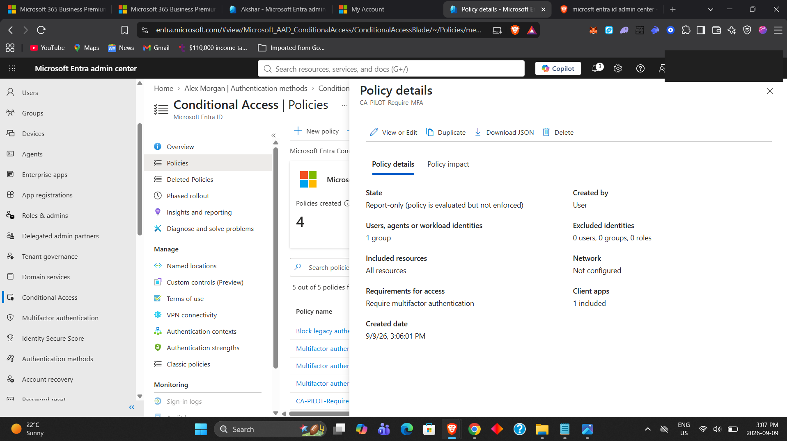

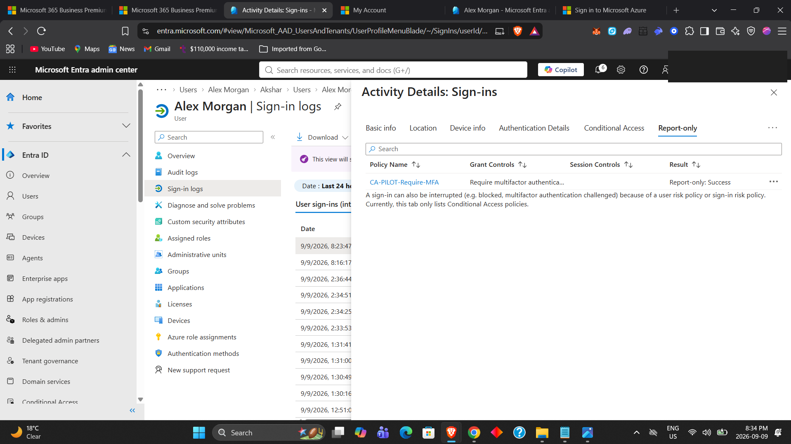

After validating the result, I enabled the policy and confirmed successful Conditional Access evaluation in the sign-in logs.

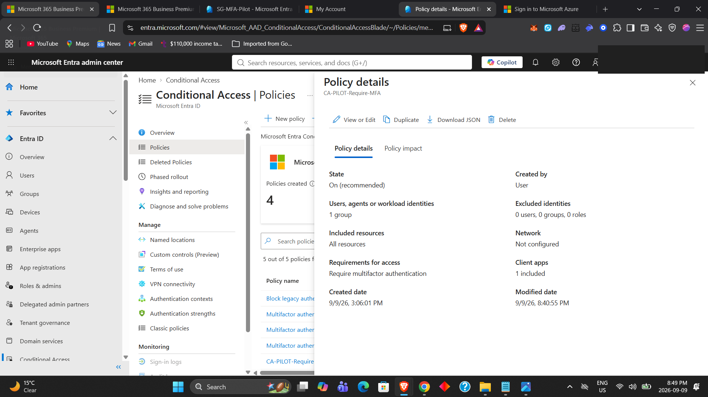

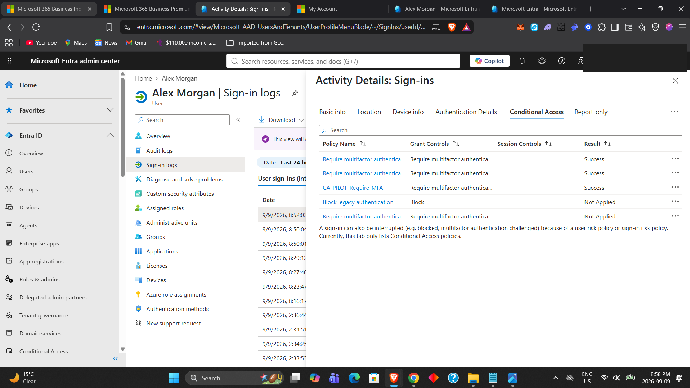

---

## 7. Conditional Access Audit Verification

I reviewed Microsoft Entra audit logs to confirm that the Conditional Access policy creation/change was recorded.

This demonstrates how administrative changes can be traced through directory auditing.

### Evidence

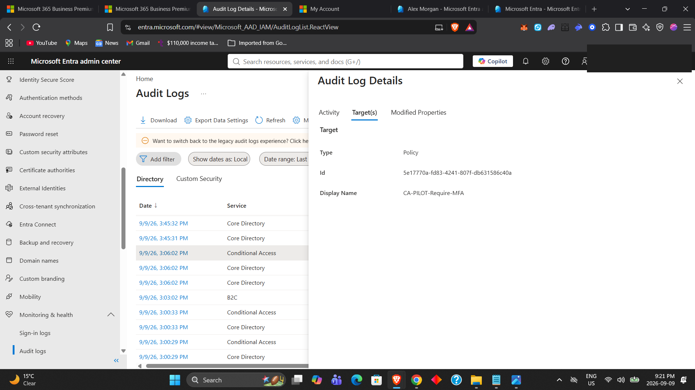

---

## 8. Sign-In Troubleshooting — Invalid Credentials

I investigated a failed sign-in and identified Entra error code:

`50126`

The failure reason indicated that the username or password was invalid.

This exercise demonstrated using sign-in logs to distinguish a credential problem from Conditional Access, MFA, or device-compliance issues.

### Evidence

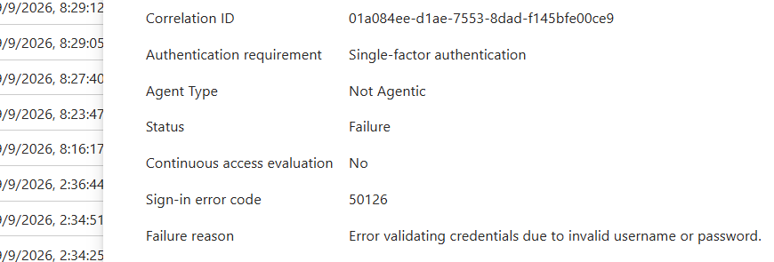

---

## 9. User Offboarding & Disabled-Account Validation

I simulated an offboarding scenario by disabling a test user account.

The result was then validated in two ways:

1. The account was visibly disabled in Entra ID.
2. A subsequent sign-in attempt failed with error code `50057`, indicating that the user account was disabled.

### Evidence

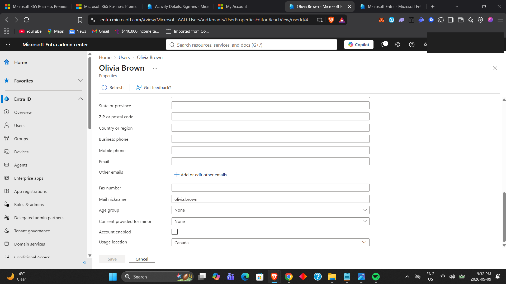

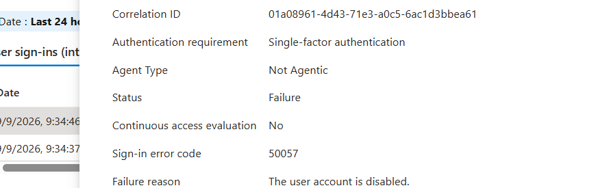

---

## 10. Audit Log Verification of Offboarding

I reviewed the audit log after disabling the account and confirmed that the `AccountEnabled` property changed from:

`true` → `false`

This provides evidence that the lifecycle change was recorded and auditable.

### Evidence

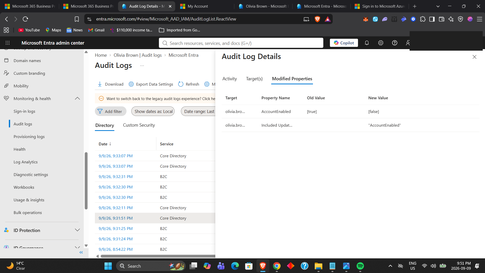

---

## 11. Conditional Access + Intune Device Compliance

I integrated Microsoft Entra Conditional Access with Microsoft Intune compliance by testing a policy that required the Windows endpoint to be marked compliant.

The policy was kept in **Report-only mode** for safe validation.

Two tests were performed:

- **Managed/compliant Windows 11 endpoint:** Report-only **Success**
- **Unmanaged endpoint:** Report-only **Failure**

This validated that Conditional Access could distinguish a compliant corporate endpoint from an unmanaged device.

### Evidence

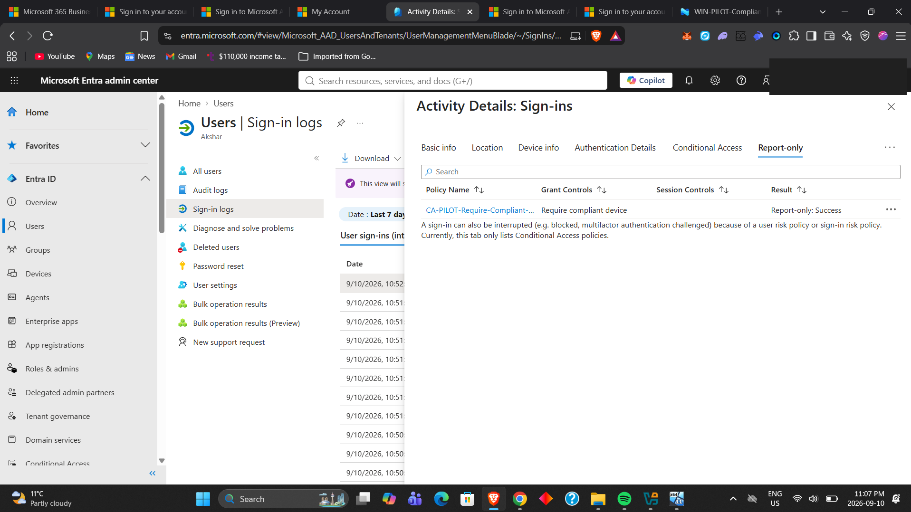

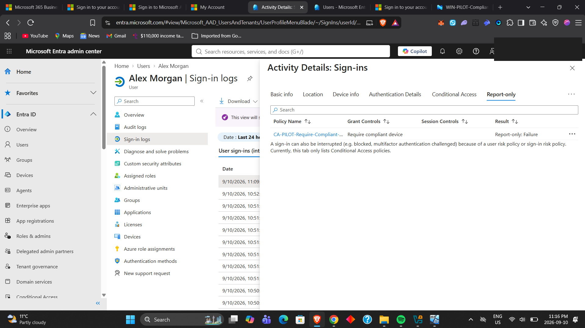

---

## Troubleshooting Approach

Throughout the lab I used the following workflow:

1. Identify the affected user, application, and sign-in.
2. Review the sign-in status and error code.
3. Check authentication requirements and MFA details.
4. Review Conditional Access evaluation.
5. Confirm device state when device compliance is involved.
6. Review audit logs for recent administrative changes.
7. Validate the result after making a controlled change.

---

## Skills Demonstrated

- Microsoft Entra ID user administration
- Security-group management
- Microsoft 365 license verification
- Role-Based Access Control (RBAC)
- Least-privilege administration
- Microsoft Authenticator configuration
- MFA registration and re-registration
- Conditional Access policy design
- Report-only testing
- Conditional Access enforcement validation
- Sign-in log investigation
- Entra error-code troubleshooting
- User offboarding
- Audit-log investigation
- Intune compliance integration

---

## Practical IT Support Relevance

These tasks map directly to common enterprise-support scenarios such as:

- Creating and maintaining user accounts
- Assigning users to groups
- Verifying Microsoft 365 licensing
- Resetting or re-registering authentication methods
- Troubleshooting MFA problems
- Investigating failed sign-ins
- Supporting locked/disabled users
- Applying least-privilege administrative roles
- Testing Conditional Access safely before enforcement
- Confirming access from managed versus unmanaged devices

---

## Key Takeaway

This lab strengthened my understanding of how Microsoft Entra ID connects **identity, authentication, authorization, auditability, and device trust**.

A useful way I now think about the environment is:

**Entra ID** → Who is the user/device?  
**MFA / Authentication Methods** → How is the identity verified?  
**Intune Compliance** → Does the device meet security requirements?  
**Conditional Access** → Should access be allowed?  
**Sign-in & Audit Logs** → What happened and why?

---

## Related Projects

- Microsoft Intune Endpoint Management & Security Lab
- Windows Server & Active Directory Administration Lab
- Microsoft 365 Administration & User Support Lab
